# Sample Discord message

## fork

## issue_comment - created

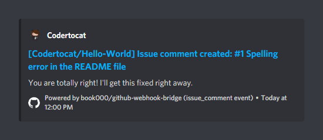
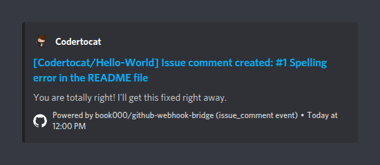

## issue_comment - deleted

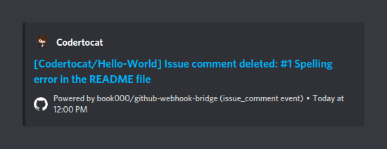

## issue_comment - edited

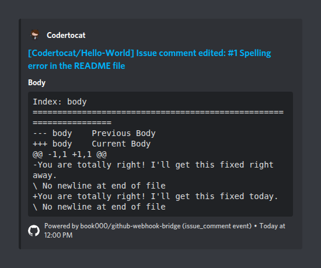
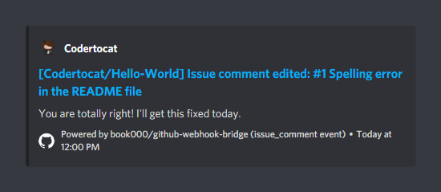

## issues - assigned

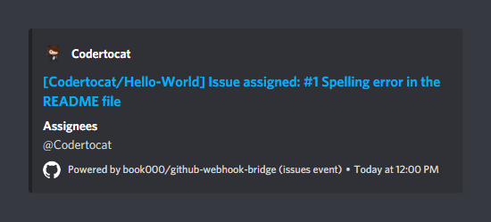
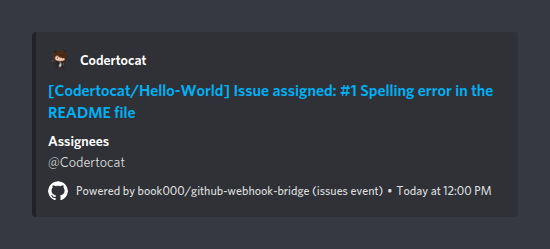

## issues - deleted

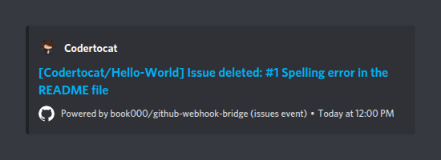

## issues - demilestoned

## issues - labeled

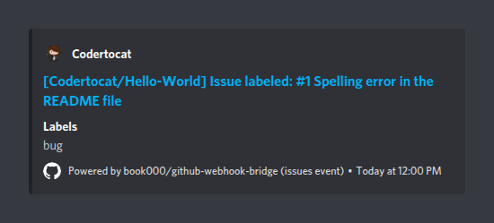
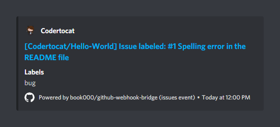

## issues - locked

## issues - milestoned

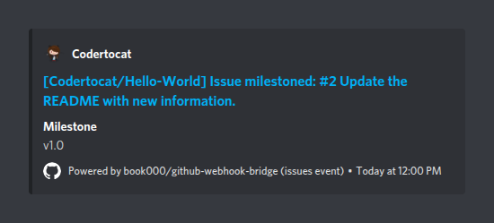

## issues - opened

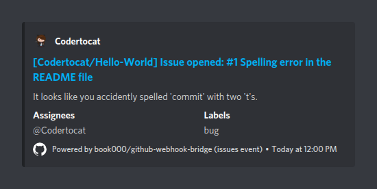
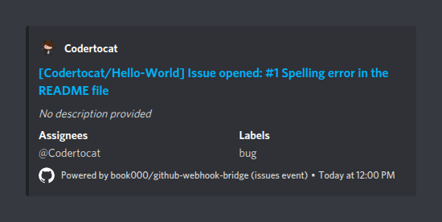

## issues - pinned

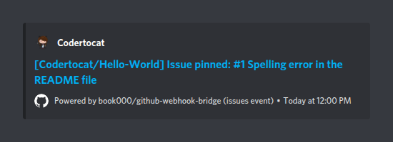

## issues - reopened

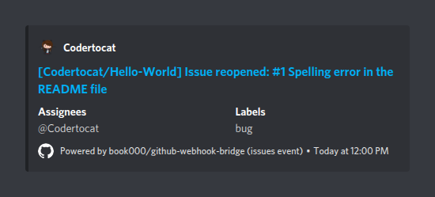

## issues - transferred

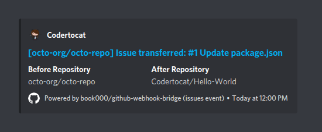

## issues - unassigned

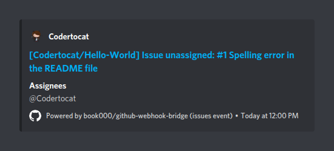

## issues - unlabeled

## issues - unlocked

## issues - unpinned

## ping

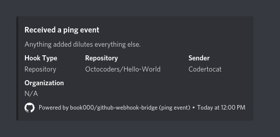
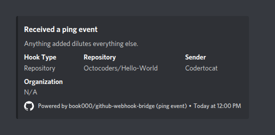
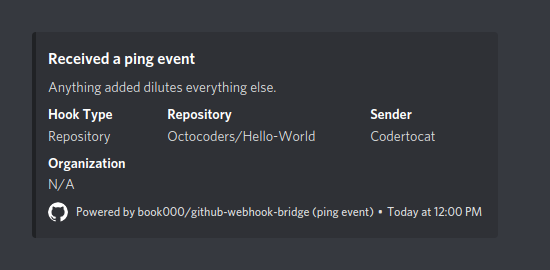
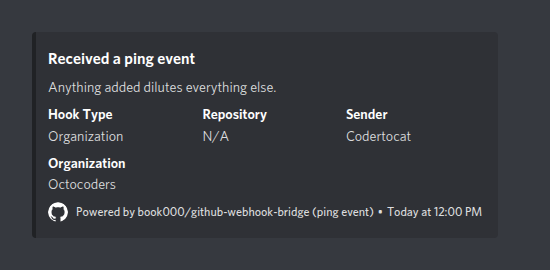

## public

## pull_request - assigned

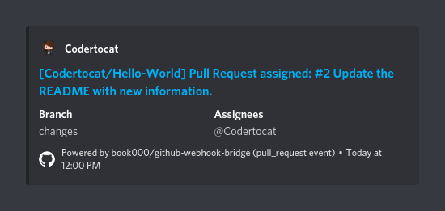
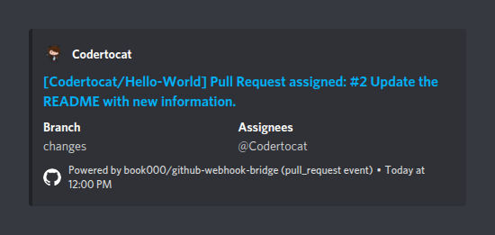

## pull_request - closed

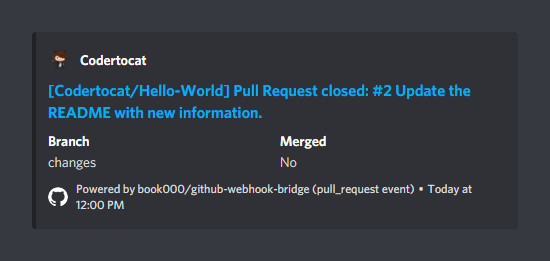
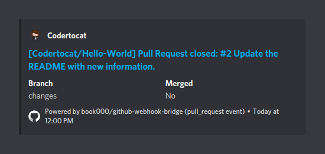

## pull_request - converted_to_draft

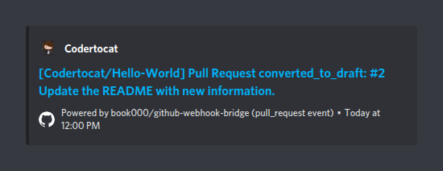

## pull_request - labeled

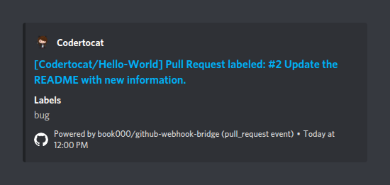

## pull_request - locked

## pull_request - opened

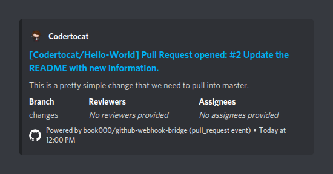
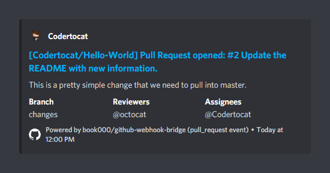
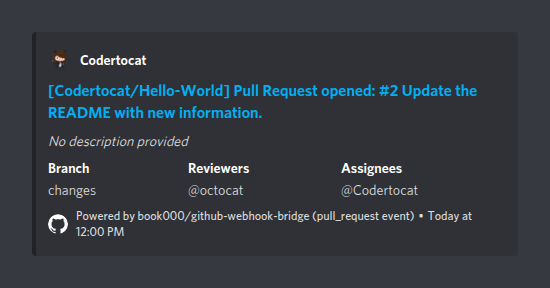
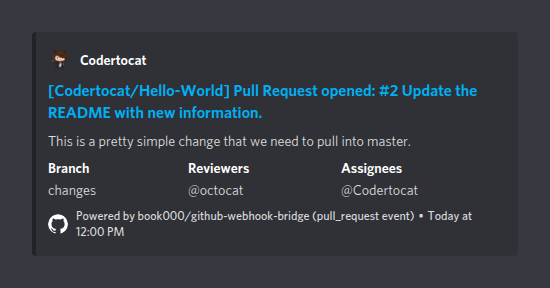

## pull_request - ready_for_review

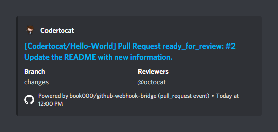

## pull_request - reopened

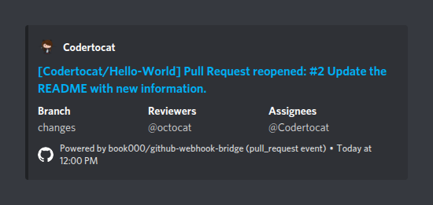

## pull_request - review_request_removed

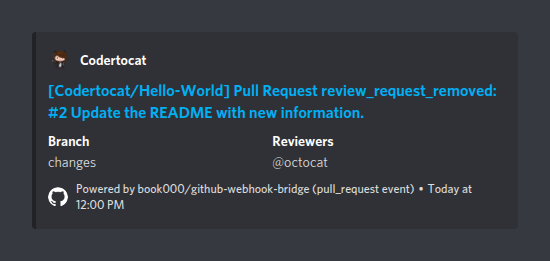

## pull_request - review_requested

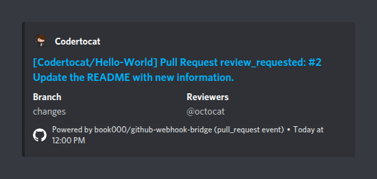

## pull_request - unassigned

## pull_request - unlabeled

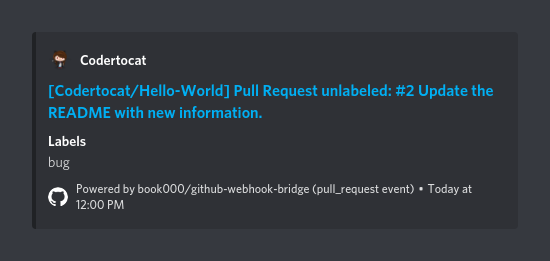
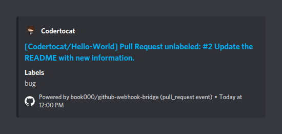

## pull_request - unlocked

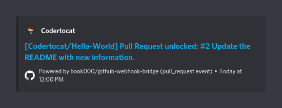

## pull_request_review - dismissed

## pull_request_review_comment - created

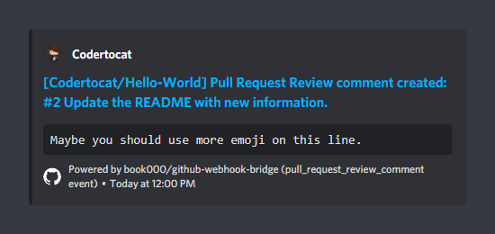

## pull_request_review_comment - deleted

## pull_request_review_comment - edited

## pull_request_review_thread - resolved

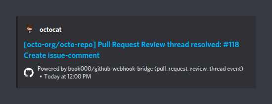
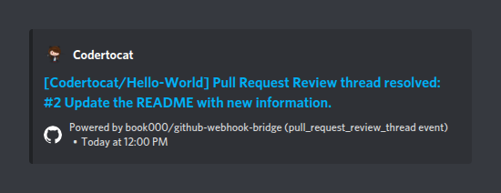

## pull_request_review_thread - unresolved

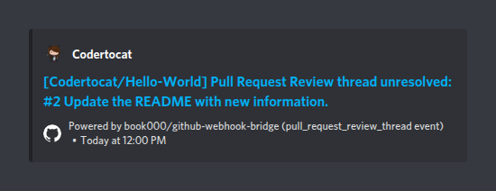

## push

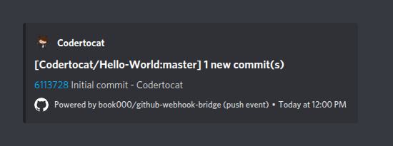

## star - created

## star - deleted

